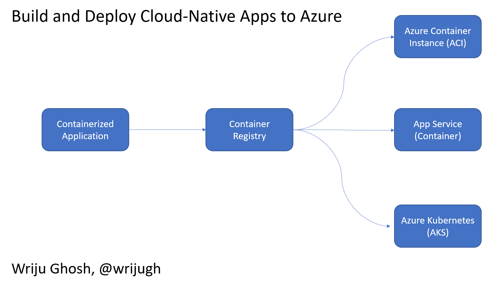

# Build 2022 Recap 
[BDotNet Bangalore on on July 8 2022]
Samples, scripts


## Architecture 



## Commands 

### Build Dotnet Core Web App

```bash
# Create a new asp.net core application
$ dotnet new --name sampleweb --no-https

# change the directory
$ cd sampleweb

# build that application
$ dotnet build 

# run the application
$ dotnet run
```

### Build and Push Docker Image

```bash
# add a Dockerfile either manually or by draft or by vscode 

# check if the docker is running 
$ docker ps 

# if docker is not running then start the docker 
$ sudo service docker start

# when docker is running, stay in the folder where Dockerfile is there 

```

## AKS

## Draft
Install draft (preview)
```bash
az extension add --name aks-preview
```
Create the Dockerfile, helm etc.
```bash
az aks draft create
```


## Scripts
### [Script to create dev vm](https://raw.githubusercontent.com/wrijugh/techtalks/master/scripts/01-azure-ubuntu-vm.sh)


### [Script to install tools inside dev vm](https://raw.githubusercontent.com/wrijugh/techtalks/master/scripts/02-install-dev-vm.sh)


### [Script to create below azure resources](https://github.com/wrijugh/techtalks/blob/master/scripts/azure-script.sh)
- Resource Group 
- Azure Container Registry (ACR)
- Azure Container Instance (ACI)
- Azure App Service 
- Azure Kubernetes Service (AKS)

